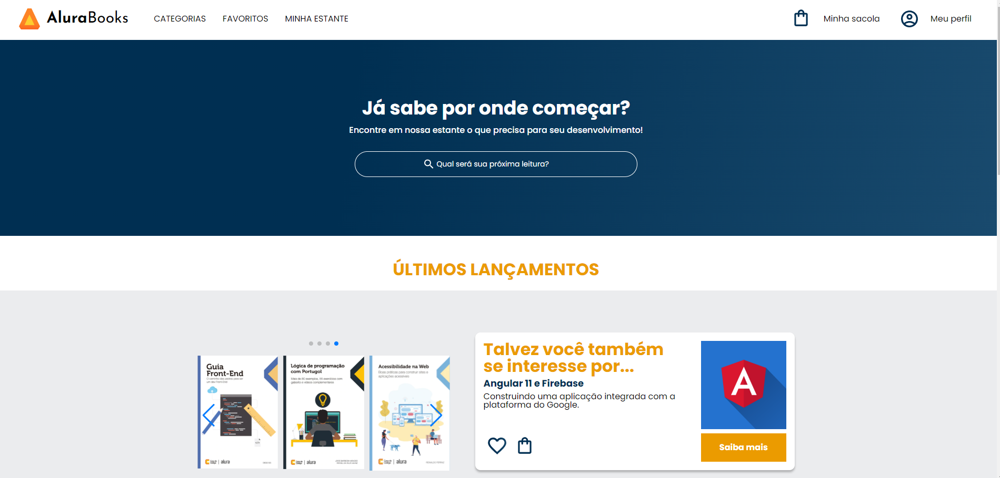

# AluraBooks

Projeto AluraBooks desenolvido em HTML e CSS (Responsive Design para as resoluções 1728px, 1024px e 428px).

## Screenshots

## Ferramentas Utilizadas

- HTML
- CSS
- CSS Flexbox
- Swiper.js

## Feito por:

Lucas Kenji
